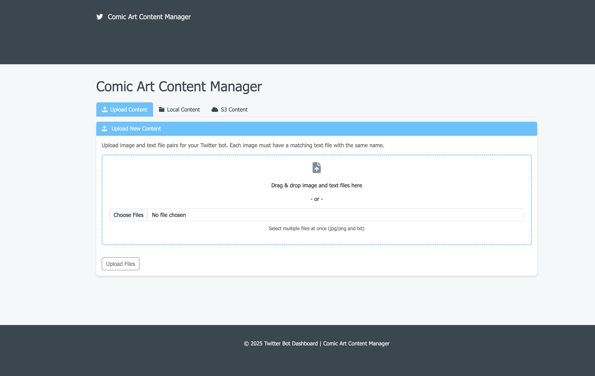

# Twitter API Bot

## Overview

The **Twitter API Bot** is a fully automated social media solution designed to help promote Kickstarter campaigns by engaging with targeted Twitter users and posting content generated with AI (using OpenAI's ChatGPT). The bot:

- **Searches for tweets** using specific hashtags.
- **Filters and stores targeted user data** in DynamoDB.
- **Extracts and stores keywords** from tweets in a dedicated DynamoDB table.
- **Posts text-only tweets** (via OAuth 2.0) using AI-generated captions based on images and summaries stored in AWS S3.
- **Automates engagement actions** (likes, retweets, replies, and direct messages) with dynamic content generated by OpenAI.
- **Provides a simple web-based content update interface** for uploading new images and summary text files to S3.
- **Includes a professional monitoring dashboard** built with Bootstrap and Chart.js.

## Features

- **Twitter API Integration:**

  - Authenticate using OAuth 1.0a (for read operations) and OAuth 2.0 (for posting tweets).
  - Search for tweets and filter users based on follower count, account age, tweet activity, and recent engagement.

- **AI Integration:**

  - Generate engaging tweet captions, comments, and direct messages using the OpenAI ChatGPT API.

- **AWS Integration:**

  - Download images and summary text files from an S3 bucket.
  - Log tweet activity, targeted users, and keyword data in DynamoDB.

- **Automated Engagement:**

  - Automatically like, retweet, reply, and send DMs to targeted users.
  - Enhanced DM generation uses additional context from a local file (`dm_context.txt`).

- **Content Update Interface:**

  - A simple Flask web interface that allows easy uploading of new content (images and summaries) to S3.

- **Monitoring Dashboard:**

  - A polished, responsive dashboard built with Bootstrap and Chart.js that displays key metrics such as the number of targeted users and keywords stored.

- **Robust Error Handling & Rate Limit Management:**
  - A custom retry decorator checks for rate limit responses and handles transient errors with exponential backoff.

## Project Structure

├── Dockerfile
├── LICENSE
├── Procfile
├── README.md
├── admin-portal
│   └── index.html
├── app.py
├── dashboard_images
│   ├── bot_status.png
│   ├── dashboard_1.png
│   ├── dashboard_2.png
│   ├── twitter_bot_command_center.png
│   ├── upload_dashboard_1.png
│   ├── upload_dashboard_2.png
│   └── upload_dashboard_3.png
├── deploy.sh
├── deployment-package.zip
├── dm_context.txt
├── docker-entrypoint.sh
├── downloads
│   ├── image1.jpg
│   ├── image1.txt
│   └── posting_history.json
├── local_test_data
│   ├── folder1
│   │   ├── image1.jpg
│   │   └── image1.txt
│   ├── folder2
│   │   ├── image2.jpg
│   │   └── image2.txt
│   ├── folder3
│   │   ├── image3.jpg
│   │   └── image3.txt
│   ├── folder4
│   │   ├── image4.jpg
│   │   └── image4.txt
│   ├── folder5
│   │   ├── image5.jpg
│   │   └── image5.txt
│   ├── folder6
│   │   ├── image6.jpg
│   │   └── image6.txt
│   ├── folder7
│   │   ├── image7.png
│   │   └── image7.txt
│   ├── folder8
│   │   ├── test_upload.png
│   │   └── test_upload.txt
│   └── folder9
│       ├── test_upload.png
│       └── test_upload.txt
├── main.logOAUTH_2_ACCESS_TOKEN=NTd2VUx6bkd1b19GNDBHandLRWkxNU56MGlZekk1Q0JHUHBiLVhsSXk0Z2hUOjE3NDA0ODc2MjY4NDU6MTowOmF0OjE
├── requirements.txt
├── src
│   ├── __init__.py
│   ├── __pycache__
│   │   ├── __init__.cpython-313.pyc
│   │   ├── ai_integration.cpython-313.pyc
│   │   ├── content_manager.cpython-313.pyc
│   │   ├── dashboard.cpython-313.pyc
│   │   ├── dynamodb_integration.cpython-313.pyc
│   │   ├── main.cpython-313.pyc
│   │   ├── regenerate_oauth2_token.cpython-313.pyc
│   │   ├── twitter_api_interactions.cpython-313.pyc
│   │   ├── twitter_bot.cpython-313.pyc
│   │   ├── upload_dashboard.cpython-313.pyc
│   │   └── upload_to_s3.cpython-313.pyc
│   ├── ai_integration.py
│   ├── content_manager.py
│   ├── dashboard.py
│   ├── dynamodb_integration.py
│   ├── main.py
│   ├── regenerate_oauth2_token.py
│   ├── twitter_api_interactions.py
│   ├── twitter_bot.py
│   ├── upload_dashboard.py
│   └── upload_to_s3.py
├── test_token_direct.py
├── token_debug.log
├── token_refresh.log
└── uploads
    └── temp
        ├── test1.jpg
        └── test1.txt

18 directories, 67 files

## Screenshots

Below are some screenshots of the dashboard and content manager in action:

### Twitter Bot Command Center


### Bot Status


### Activity Logs


### Dashboard (Main View)


### Dashboard (Activity & Metrics)


### Content Manager (Upload View)



### Content Manager (Local Content)


### Content Manager (S3 Content)


## Installation

1. **Clone the Repository:**

   ```bash
   git clone https://github.com/carlosrod723/Twitter-API-Bot.git
   cd Twitter-API-Bot
   ```

## Installation

1. **Clone the Repository:**

```bash
   git clone https://github.com/carlosrod723/Twitter-API-Bot.git
   cd ai-twitter-bot
```

2. **Set Up a Virtual Environment:**

```bash
python -m venv venv
source venv/bin/activate  # On Windows: venv\Scripts\activate
```

3. **Install Dependencies:**

```bash
pip install -r requirements.txt
```

4. **Configure Environment Variables:**

- Create a .env file in the project root with the following variables:

```bash
OPENAI_SECRET_KEY
TWITTER_CONSUMER_KEY
TWITTER_CONSUMER_SECRET
TWITTER_ACCESS_TOKEN
TWITTER_ACCESS_TOKEN_SECRET
TWITTER_BEARER_TOKEN
OAUTH_2_CLIENT_ID
OAUTH_2_CLIENT_SECRET
OAUTH_2_ACCESS_TOKEN
AWS_ACCESS_KEY
AWS_SECRET_ACCESS_KEY
BUCKET_NAME
BUCKET_REGION
DYNAMODB_TABLE
```

## Usage

**Running the Bot**

- Main Bot Scheduler:
  The main bot workflow is located in src/main.py. This script handles scheduled tweet posting, targeted user monitoring, keyword extraction, and automated engagement.

```bash
python -m src.main
```

This will start the scheduler to run various jobs (e.g., tweet posting every hour).

- Content Update Interface:
  To update content (images and summaries) in your S3 bucket:

```bash
python -m src.content_update
```

Open your browser at http://localhost:5002 to use the file-upload interface.

- Dashboard:
  To view the monitoring dashboard:

```bash
python -m src.dashboard
```

Open your browser at http://localhost:5003 to see key metrics.

## Testing

**Run Unit & Integration Tests:**

```bash
pytest -s
```

This runs all tests in the tests/ folder, including those for AWS, DynamoDB, Twitter API functionality, and keyword extraction.

## Deployment with Docker & Gunicorn

1. Build the Docker Image

```bash
docker build -t twitter-bot .
```

2. Run the Docker Container:
   For example, to run the dashboard app with Gunicorn:

```bash

docker run -d -p 5003:5003 --name twitter-bot-dashboard twitter-bot
```

Make sure your Dockerfile is configured to start Gunicorn with:

```dockerfile
CMD ["gunicorn", "--bind", "0.0.0.0:5003", "src.dashboard:app"]
```

(Optional) Configure HTTPS:
If your endpoints are public, use a reverse proxy (e.g., Nginx) or an AWS Application Load Balancer with an SSL certificate to serve content over HTTPS.
